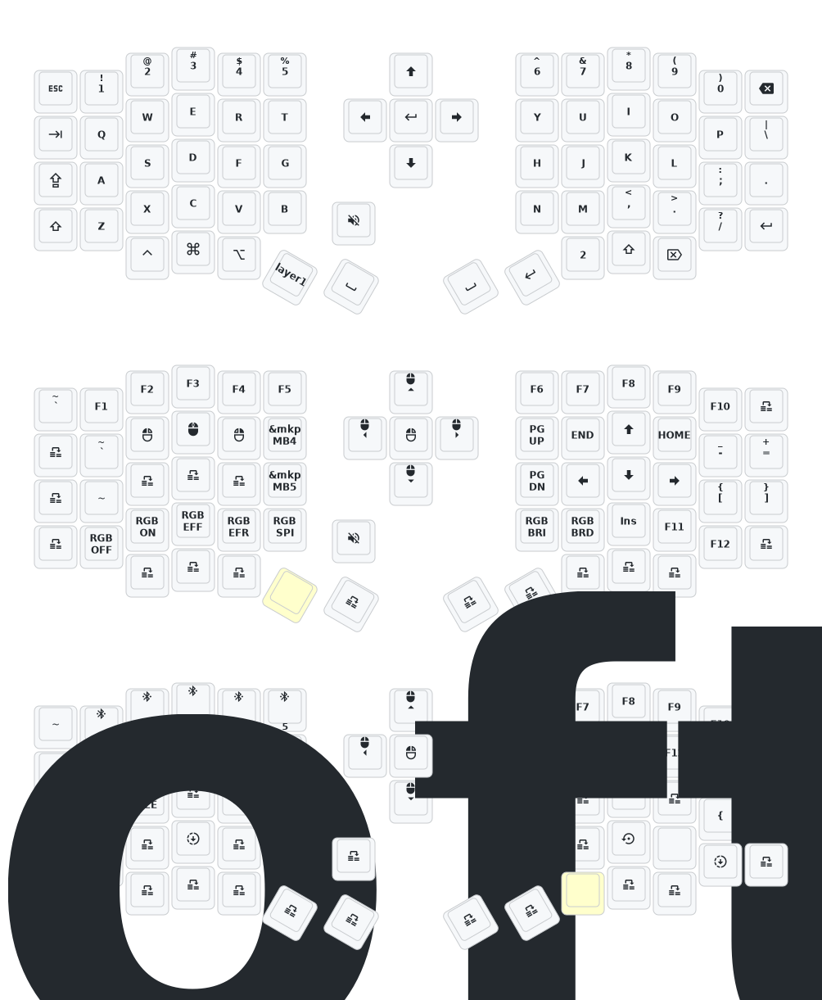
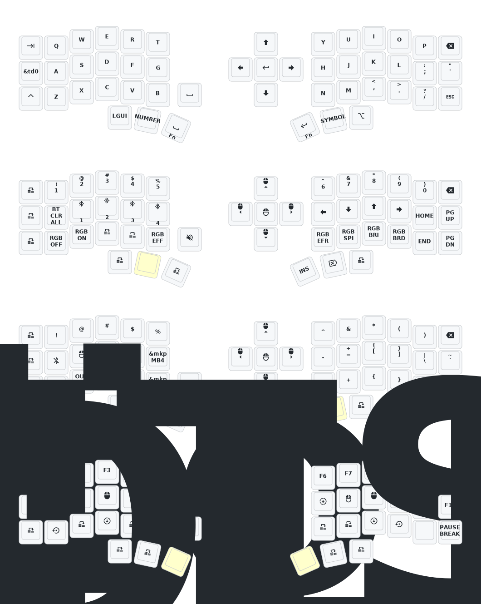

<<<<<<< HEAD
<<<<<<< HEAD
2024年10月24日更新内容：修改供电模式，功耗降低。修正RGB供电自动关闭的功能。如果您的键盘于10月24日之前更新，请更新最新的固件。
Update on October 24, 2024: Modified power supply mode to reduce power consumption. Corrected the function of automatic shutdown of RGB power supply. If your keyboard is updated before October 24th, please update the latest firmware.

如需3D打印的模型文件或者键盘有任何异常和故障，请联系380465425@qq.com
If you need the 3D printed model file or if there are any abnormalities with the keyboard, please contact 380465425@qq.com
# zmk-config-sofle




=======
# 睫毛外设 (Eyelash Peripherals) Corne ZMK Repository
=======
2024年10月24日更新内容：修改供电模式，功耗降低。修正RGB供电自动关闭的功能。如果您的键盘于10月24日之前更新，请更新最新的固件。
Update on October 24, 2024: Modified power supply mode to reduce power consumption. Corrected the function of automatic shutdown of RGB power supply. If your keyboard is updated before October 24th, please update the latest firmware.
>>>>>>> dc0416c (solfe)

如需3D打印的模型文件或者键盘有任何异常和故障，请联系380465425@qq.com
If you need the 3D printed model file or if there are any abnormalities with the keyboard, please contact 380465425@qq.com
# zmk-config-sofle


<<<<<<< HEAD
## Instructions

1. [Fork this repository](https://docs.github.com/en/get-started/quickstart/fork-a-repo#forking-a-repository).
2. [Click the **Actions** tab and make sure the workflow is enabled](https://docs.github.com/en/actions/managing-workflow-runs-and-deployments/managing-workflow-runs/disabling-and-enabling-a-workflow#enabling-a-workflow).
3. Make sure the `eyelash_corne` project in [`config/west.yml`](config/west.yml) still works. The `boards/arm/eyelash_corne` folder will be downloaded from this URL.
4. If there is still a `boards/arm/eyelash_corne` folder in your fork, delete it.

**If you already have a ZMK config repository, [you can add this one as a module instead of forking](https://zmk.dev/docs/features/modules#building-with-modules).**

## Keymap Diagram



## Mouse Support

:warning: This repository defaults to an EXPERIMENTAL mouse movement branch which is slated for eventual merge into ZMK, but is not guaranteed to be stable. For more information, see [beta testing](https://zmk.dev/docs/features/modules#beta-testing) and [PR #2477](https://github.com/zmkfirmware/zmk/pull/2477).

If desired, edit your `config/west.yml` to switch back to `zmkfirmware`'s `main` branch:

```diff
diff --git a/config/west.yml b/config/west.yml
index ac30a68..70ad540 100644
--- a/config/west.yml
+++ b/config/west.yml
@@ -13,8 +13,8 @@ manifest:
       url: https://github.com/a741725193/zmk-new_corne
       revision: main
     - name: zmk
-      remote: petejohanson
-      revision: feat/pointers-with-input-processors
+      remote: zmkfirmware
+      revision: main
       import: app/west.yml
   self:
     path: config
```
>>>>>>> 913ba43 (go)
=======
>>>>>>> dc0416c (solfe)
